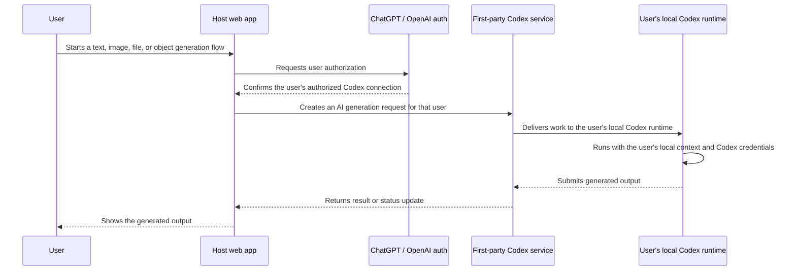

# CodexDock

CodexDock lets a web app send AI work to each user's own local Codex runtime instead of running every AI task from the web server.

The host app stores an invocation with `@codexdock/sdk`. The matching user's local `codexdock` worker connects outbound to the host app, claims that user's pending work, runs it with the Codex SDK, and submits the result back to the host app.

Documentation: [codexdock.tahooki.com](https://codexdock.tahooki.com)

## Developer Note

CodexDock is a bridge, not the ideal end state I hope for.

The experience I want is a first-party Codex capability backed by ChatGPT/OpenAI auth: a user signs in, authorizes a host app, connects that app to their own local Codex runtime, and lets the app request text, image, file, or structured-object generation through a supported AI generation API. The host app should not need to manage ad hoc pairing codes, long-lived worker tokens, or its own local-runtime relay protocol just to let a user bring their own Codex environment.

That desired shape is different from the current CodexDock implementation. CodexDock exists because the first-party version is not available yet. Until that kind of Codex-native, ChatGPT-authenticated generation flow exists, this project provides a practical approximation with explicit host routes, owner-scoped workers, and a local CLI process.

Desired first-party flow:



## When To Use It

- You want each signed-in user to use their own local Codex login/runtime.
- You need async AI jobs with `pending`, `running`, `completed`, and `failed` states.
- You want structured objects, file artifacts, or image artifacts returned through one worker result contract.
- You do not want your web server to act as an OpenAI `/v1/*` proxy.

## Install

In the host web app:

```bash
pnpm add @codexdock/sdk
```

On the machine that will run the local worker:

```bash
pnpm add -g codexdock
```

## Add CodexDock To A Host App

Create a shared server-side CodexDock instance:

```ts
import {
  createCodexDock,
  createMemoryPersistence,
} from "@codexdock/sdk";

export const codexdock = createCodexDock({
  appName: "Your App",
  persistence: createMemoryPersistence(),
  defaultOwner: { ownerKind: "system", ownerId: "local-dev" },
  resolveOwner: async (request) => resolveOwnerFromSession(request),
  resolveWorkerAuth: async (request) => resolveOwnerFromWorkerToken(request),
});
```

`createMemoryPersistence()` is only for local examples. Production apps should provide database-backed persistence so invocations survive deploys and restarts.

`defaultOwner` is the app-facing owner used when you call `codexdock.invoke()` directly without a request. For product routes, pass `resolveOwner(request)` so the host app derives the owner from a trusted browser cookie, session, account, workspace, or system job instead of trusting request body ownership fields.

`resolveWorkerAuth(request)` validates the worker bearer token and returns the owner scope attached to that token. The example app issues short-lived pairing codes, exchanges them for high-entropy worker tokens, stores only hashes, and uses Postgres when `DATABASE_URL` or `POSTGRES_URL` is available.

## User-Scoped Runtime Model

CodexDock is primarily user-scoped, not service-scoped.

- A user connects their own local Codex worker to the host app.
- Invocations created by that user should be stored with an owner such as an anonymous browser UUID, `userId`, `accountId`, or `workspaceId`.
- A worker token should be scoped to that owner and worker.
- `worker/next` should only return invocations for the worker's owner.
- `worker/result` should only accept results for invocations claimed by that same owner-scoped worker.

A host app may also create a system-owned worker for back-office automation, but that should be modeled as an explicit `system` owner, not as the default behavior for all users.

Expose these route handlers from your app. The paths below are conventional defaults, not a security boundary. A host app can mount them elsewhere as long as its discovery manifest points the CLI to the right URLs.

| Route | Export |
| --- | --- |
| `GET /api/codexdock/discovery` | `export const GET = codexdock.handlers.discovery;` |
| `POST /api/codexdock/invoke` | `export const POST = codexdock.handlers.invoke;` |
| `GET /api/codexdock/invocations/[invocationId]` | `export const GET = codexdock.handlers.getInvocation;` |
| `POST /api/codexdock/worker/connect` | `export const POST = codexdock.handlers.workerConnect;` |
| `GET /api/codexdock/worker/status` | `export const GET = codexdock.handlers.workerStatus;` |
| `POST /api/codexdock/worker/next` | `export const POST = codexdock.handlers.workerNext;` |
| `POST /api/codexdock/worker/result` | `export const POST = codexdock.handlers.workerResult;` |

## Create Work

Text:

```ts
const invocation = await codexdock.invoke({
  type: "generate_text",
  prompt: "Write one sentence about the current scene.",
  parameters: { tone: "friendly", usage: "scene_caption" },
});
```

Structured object:

```ts
const invocation = await codexdock.invoke({
  type: "generate_object",
  prompt: "Create four product cards.",
  parameters: { count: 4, usage: "product-preview" },
});
```

File artifact:

```ts
await codexdock.invoke({
  type: "generate_file",
  prompt: "Draft a concise README.",
  parameters: { targetPath: "README.md", usage: "repo-doc" },
});
```

Image artifact:

```ts
await codexdock.invoke({
  type: "generate_image",
  prompt: "Create a square thumbnail for a language-learning scene.",
  parameters: {
    filename: "scene-thumbnail.png",
    usage: "scene_thumbnail",
    sceneId: "scene_123"
  },
});
```

`invoke()` returns an invocation handle immediately:

```json
{
  "invocationId": "inv_123",
  "status": "pending",
  "statusUrl": "/api/codexdock/invocations/inv_123"
}
```

Poll `statusUrl` or use your own app's job UI to show progress and results.

Protect the app-facing invoke route with your normal product auth, rate limits, and quota checks. CodexDock authenticates worker traffic, but it does not know which of your users are allowed to create AI jobs.

## Run A Worker

Connect the local worker to your host app:

```bash
codexdock connect https://your-app.example.com --code "$PAIRING_CODE"
```

`connect` reads `/api/codexdock/discovery` when available, exchanges the pairing code for an owner-scoped worker token, and stores the host's endpoint map locally. Each successful `connect` becomes the default connection used by the next `codexdock start`; in the example host, a new token for the same owner and worker revokes earlier tokens. Use `--connection <id>` with `start` or `status` if you have more than one host/owner connection.

Start the worker:

```bash
codexdock start --codex-workdir /path/to/project
```

For a non-git working directory:

```bash
codexdock start \
  --codex-workdir /path/to/project \
  --skip-git-repo-check
```

## Result Contracts

`generate_text` results are stored as text envelopes:

```json
{
  "kind": "text",
  "summary": "Generated text.",
  "parameters": {
    "tone": "friendly",
    "usage": "scene_caption"
  },
  "text": "A concise sentence for the host app.",
  "provider": "codexdock",
  "model": "local-codex",
  "usage": {
    "inputTokens": null,
    "outputTokens": null,
    "totalTokens": null,
    "source": "unavailable"
  }
}
```

`generate_object` results are stored as structured object envelopes:

```json
{
  "kind": "object",
  "summary": "Generated structured object.",
  "parameters": {
    "count": 4,
    "usage": "product-preview"
  },
  "object": {
    "items": []
  }
}
```

`generate_file` results are stored as file artifacts:

```json
{
  "kind": "file",
  "summary": "Generated README.md.",
  "parameters": {
    "targetPath": "README.md",
    "usage": "repo-doc"
  },
  "filename": "README.md",
  "mediaType": "text/markdown",
  "encoding": "utf-8",
  "content": "# Project\n\n..."
}
```

`generate_image` results are stored as image artifacts:

```json
{
  "kind": "image",
  "summary": "Generated image artifact.",
  "parameters": {
    "filename": "scene-thumbnail.png",
    "usage": "scene_thumbnail",
    "sceneId": "scene_123"
  },
  "filename": "scene-thumbnail.png",
  "mediaType": "image/png",
  "encoding": "base64",
  "base64": "...",
  "dataUri": "data:image/png;base64,...",
  "promptUsed": "..."
}
```

`parameters` is echoed from the original invocation. CodexDock stores it with the invocation and attaches it to completed results before saving, so the host app can decide whether an image is a scene thumbnail, avatar, background, review-only output, or something else.

The SDK validates completed `generate_text`, `generate_object`, `generate_file`, and `generate_image` worker results before saving them. Invalid results are rejected with `INVALID_PAYLOAD`.

For production image/file flows, small artifacts can be returned inline first. Larger artifacts should be uploaded through a host-app storage adapter or a dedicated worker artifact upload endpoint, then represented in the final result as `artifactId`, `url`, or `storagePath`.

## Security Model

CodexDock routes can use a stable base path such as `/api/codexdock`; security must come from authentication and authorization, not from hiding the path.

- Worker endpoints require a bearer worker token by default.
- The host app should wrap `POST /api/codexdock/invoke` with its own user/admin auth.
- The host app should apply rate limits and request-size limits to invoke and result routes.
- Workers can only submit results for invocations they claimed.
- `generate_text`, `generate_object`, `generate_file`, and `generate_image` results are schema-validated before being stored.
- Production worker tokens should be high entropy, stored hashed where possible, rotated, and revocable.

## Current Status

Working now:

- Owner-scoped invocation and worker records in the SDK memory persistence adapter.
- Example app Postgres persistence for invocations, workers, pairing codes, and hashed worker tokens.
- Short-lived pairing codes exchanged by the CLI for owner-scoped worker tokens.
- Owner-scoped `worker/next`, `worker/result`, worker status, and invocation reads.
- `generate_text`, `generate_object`, `generate_file`, and inline/base64 `generate_image` result validation.
- Discovery manifest handler and CLI endpoint-map storage.
- CLI config that can store/select multiple host/owner connections.

Still planned:

- Admin revoke flows and richer pairing approval UI.
- Multipart or signed artifact upload for large files/images.
- Convenience helpers such as `generateText()` and `generateObject()` on top of the current `invoke()` API.
- Framework-specific mounting examples beyond the Next.js example app.

## Packages

- `@codexdock/sdk`: server-side SDK, shared protocol types, and Zod schemas for host web apps
- `codexdock`: local CLI worker

## Development

```bash
pnpm install
pnpm check
pnpm build
pnpm qa:smoke
```

Run the example app:

```bash
pnpm dev
```

## Documentation

- [CodexDock documentation](https://codexdock.tahooki.com)
- [API docs](https://codexdock.tahooki.com/api-docs)
- [Architecture sequence diagrams](docs/codexdock-architecture-sequences.md)
- [Development spec and TODO](docs/codexdock-development-spec-and-todo.md)
- [Planning document](docs/codexdock-planning-and-development.md)
- [Owner-scoped SDK implementation plan](docs/codexdock-owner-scoped-sdk-implementation-plan.md)
- [OpenAI API inspired generation plan](docs/openai-api-inspired-generation-plan.md)
- [npm publish guide](docs/npm-publish-guide.md)
